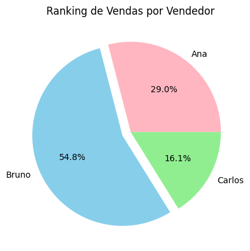

# 📊 Análise de Vendas com Python e Pandas

Este projeto faz parte do meu portfólio de transição para a área de dados, onde foco em unir automação com Python e visão estratégica de negócio.

## 🚀 O que este projeto faz:
* **Tratamento de Dados:** Identifica e trata valores nulos, corrige tipos de dados e padroniza formatos de data e nomes de produtos.
* **Cálculo de Métricas:** Criação automática da coluna de Faturamento (Preço x Quantidade).
* **Visualização de Dados:** Gera gráficos de barras comparando o faturamento total por região para identificar os melhores mercados.
* **Exportação Automatizada:** Gera um arquivo Excel (`.xlsx`) higienizado e pronto para uso em ferramentas como Power BI.

## 🛠️ Tecnologias Utilizadas:
* **Python:** Linguagem base.
* **Pandas:** Biblioteca para manipulação e análise de tabelas.
* **Matplotlib:** Biblioteca para criação de gráficos.
* **Openpyxl:** Engine para exportação de arquivos Excel.

## 📈 Resultado Básico da Análise

Este gráfico identifica os top performers da equipe. Note que a diferença entre o primeiro e o último colocado pode indicar a necessidade de um treinamento de padronização de vendas ou redistribuição de leads.

## 📂 Como visualizar os resultados:
1. O código completo está no arquivo `analise_dados_python.ipynb`.
2. O resultado final da limpeza pode ser conferido em `vendas_final_processado.xlsx`.

---
*Projeto desenvolvido para consolidar conhecimentos em análise de dados e versionamento com Git.*